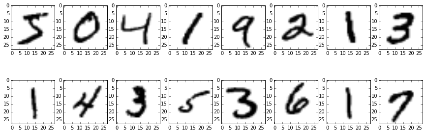
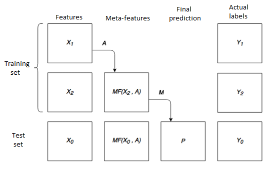

# Stacking

## Stacking method for multi-class classification

Build a classifier which can recognize handwritten digits from the MNIST database.

$X = \{x_1,\dots,x_n\}$ - images

$a:X \to \{0,\dots,9\}$ - classifier

Quality function: $$ Q(a) = \frac{1}{n} \sum_{i=1}^n 1[a(x_i)=y_i] $$

## Data preprocessing

* reshape images to vectors and use them as features
* apply Principal Component Analysis for dimensionality reduction

$X = USV^T \to \hat{X} = X V_r V_r^T$

## Basic classifiers

| Classifier               | Quality |
| ------------------------ |:-------:|
| Logistic regression      | $0.912$ | 
| Support Vector Machine   | $0.938$ |  
| Random Forest            | $0.928$ | 
| Extra Trees              | $0.930$ |

## Stacking

### Splitting data to avoid underfitting
* Bootstrap
* Random
* K-fold

## Results

| Base classifier       | Meta classifier       |Quality  |
| --------------------- |-----------------------|:-------:|
| Logistic regression   | Support Vector Machine| $0.963$ | 
| Support Vector Machine| Random Forest         | $0.924$ |  
| Extra Trees           | Logistic regression   | $0.958$ | 
| SVM (linear kernel)   |SVM (poly kernel)      | $0.963$ |
| Random Forest         | Support Vector Machine| $0.967$ | 
|Extra Trees            | Support Vector Machine| $\mathbf{0.977}$ | 
