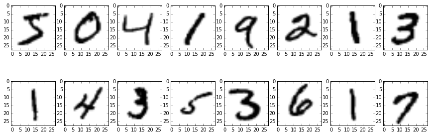
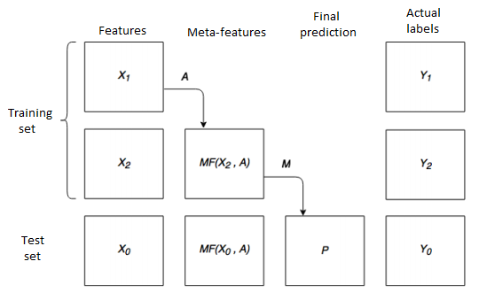

# Stacking


## Stacking method for multiclass classification

-> Oleksii Hrinchuk <-

<center>_Mikhail Karasikov_</center>

## Problem

Build a classifier which can recognize handwritten digits from the MNIST database.

$X = \{x_i\}_{i=1}^n$ - images

$a:X \rightarrow \{0,\dots,9\}$





Quality function:
$$
Q(a) = \frac{1}{n} \sum_{i=1}^n I(a(x_i)=y_i)
$$

## Data preprocessing

* reshape images to vectors and use them as features
* apply Principal Component Analysis for dimensionality reduction

$X = USV^T \to \hat{X} = X V_r V_r^T$

## Basic classifiers

| Classifier        | Quality   |
| ----------------- |:---------:|
| Logistic regression      | $0.912$ | 
| Support Vector Machine   | $0.938$ |  
| Random Forest            | $0.928$ | 
| Extra Trees              | $0.930$ |

## Stacking



### Splitting data to avoid underfitting
* Bootstrap
* Random
* K-fold

## Results


| Folding       | Quality   |
| ----------------- |:---------:|
| 3-fold     | $0.952$ | 
| 5-fold   | $0.959$ |  
| 10-fold          | $0.961$ | 
| 15-fold              | $\mathbf{0.964}$ |
| 20-fold              | $0.963$ |
| 40-fold   | $\mathbf{0.964}$ |  
| 50-fold          | $\mathbf{0.964}$ | 
| 100-fold              | $0.963$ |

| Base classifier       | Meta classifier |Quality   |
| ----------------- |-----------|:---------:|
| Logistic regression     | Support Vector Machine| $0.963$ | 
| Support Vector Machine  | Random Forest| $0.924$ |  
| Extra Trees          | Logistic regression| $0.958$ | 
| SVM (linear kernel)|SVM (poly kernel) | $0.963$ |
| Random Forest     | Support Vector Machine| $0.967$ | 
|Extra Trees     | Support Vector Machine| $\mathbf{0.977}$ | 

## Extensible code


```python
class Stacking(object):
    """Base class for stacking method of learning.
    """
    
    def __init__(self, base_fitter, meta_fitter, 
                 split=lambda I: list(KFold(n=I.size, n_folds=2, shuffle=True)),
                 decision_rule=lambda estimations: max(set(estimations), 
                                                       key=estimations.count)):
        pass
        
    def fit(self, X, y):
        """Build compositions of classifiers.
        
        Parameters
        ----------
        X : array-like or sparse matrix of shape = [n_samples, n_features]
         
        y : array-like, shape = [n_samples]
        
        Returns
        -------
        self : object
            Returns self.
        """
        pass
    
    def predict(self, X):
        """Predict class for X.
        
        The predicted class of an input sample is computed as the majority
        prediction of the meta-classifiers.
        
        Parameters
        ----------
        X : array-like or sparse matrix of shape = [n_samples, n_features]
        
        Returns
        -------
        y : array of shape = [n_samples]
            The predicted classes.
        """
        pass

```


```python
class Classifier(object):
    """Classifier wrapper.
    """    
    def __init__(self, predict_function):
        self.predict = predict_function

def get_SVM_fitter(C=1., kernel='linear', degree=3, gamma=1.):
    return lambda X, y: Classifier(SVC(C=C, kernel=kernel, 
                                       degree=degree, gamma=gamma).fit(X, y).predict)

def SVM_fitter(X, y):
    classifier = SVC(kernel=kernel, degree=degree, gamma=gamma).fit(X, y)
    return Classifier(classifier.predict)

def logit_fitter(X, y):
    classifier = LogisticRegression('l2', False).fit(X, y)
    return Classifier(classifier.predict)

def random_forest_fitter(X, y):
    classifier = RandomForestClassifier().fit(X, y)
    return Classifier(classifier.predict)

def random_forest_proba_fitter(X, y):
    classifier = RandomForestClassifier().fit(X, y)
    return Classifier(classifier.predict_proba)

def extra_trees_proba_fitter(X, y):
    classifier = ExtraTreesClassifier().fit(X, y)
    return Classifier(classifier.predict_proba)
```


```python
wildfowl = Stacking(base_fitter=extra_trees_proba_fitter, 
                    meta_fitter=get_SVM_fitter(C=5, kernel='poly', degree = 2), 
                    split=lambda I: list(KFold(n=I.size, n_folds=5, shuffle=True)))
```
